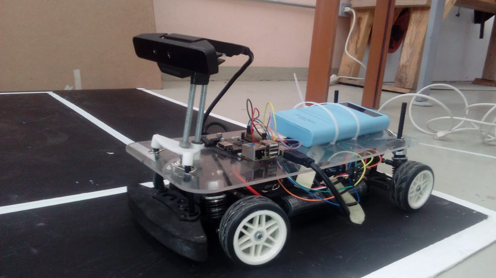

In order to obtain my degree I needed to develop a project along three semesters. The first of those was dedicated to write the research protocol, the second one was dedicated to read related bibliography, order materials, and make simulations to show the viability of the project. Finally, the last semester was dedicated to assemble the car, programming the algorithms and realize tests over tests.

There were several technologies used for this project, about hardware I used a commercial RC 1:10 chassis, an Intel RealSense SR-300 as RGB-D sensor, a Single-Board-Computer model Rock64, and a AVR-based board for the car manipulation in low level. The software side was compossed by Python used for the control simulations, C++ for the codes over the Single-Board-Computer based on the OpenCV library.

This project had the following objectives
- Lane following.
- Transit signals detection.
- Continuous driving (the combination of both).

The lane following was realized using classic Computer Vision algorithms, with processes like gaussian blurring, boards detection, crop to a Region-of-Interest and finally Line detection.
Another objective was the transit signals detection, which hadn't an AI approach, however it uses an approach with SURF and SIFT algorithms, and according to the number of descriptors which match it's easy to decide the signal found. Now using the Depth part of the camera is used in order to find the distance to the signal from the front of the car.

The results were satisfactory and there is a repository with all the codes and documentation in spanish here: <a href="https://github.com/clivan/TT"><i class="large github icon"></i>clivan/TT</a>
